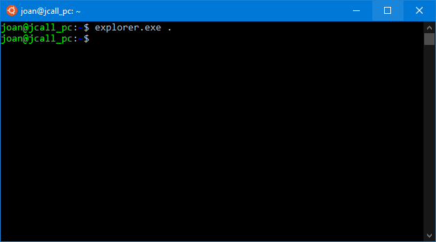

# <b>¿Qué es WSL2?</b>

<cite style="display:block; text-align: justify">
El subsistema de Windows para Linux 2 (WSL2) es la solución más sencilla y eficiente para utilizar aplicaciones Linux en Windows. WSL2 permite el acceso a las herramientas y aplicaciones Linux directamente desde el entorno Windows habitual y, por ello, es especialmente interesante para programadores. Gracias a la arquitectura completamente revisada respecto a la versión anterior, WSL2 ofrece un mayor rendimiento que los planteamientos comparables que existen.

WSL2, que fue lanzado en la primavera de 2020, es un perfeccionamiento de [Windows Subsystem for Linux (WSL1)][1_0]. Linux es un sistema operativo de [código abierto][1_1] que se diferencia fundamentalmente de Windows, que se desarrolla y distribuye como un producto comercial. Linux convence especialmente por su amplia variedad de herramientas de programación y otros paquetes de software disponibles libremente.</cite>

 

[1_0]:https://www.ionos.es/digitalguide/servidores/know-how/windows-subsystem-for-linux-wsl/

[1_1]:https://www.ionos.es/digitalguide/servidores/know-how/que-es-el-open-source-o-codigo-abierto/

# <b>Arquitectura WSL2</b>

# <b>¿Qué puedo hacer con WSL?</b>

<cite style="display:block; text-align: justify">WSL le permite ejecutar Linux en un shell de Bash con su elección de distribución (Ubuntu, Debian, OpenSUSE, Kali, Alpine, etc.). Con Bash, puedes ejecutar aplicaciones y herramientas de Linux de línea de comandos. Por ejemplo, escribe
                        
                                        lsb_release -a 
y presiona Entrar para ver los detalles de la distribución de Linux que se está ejecutando actualmente</cite>

<cite style="display:block; text-align: justify">También puede acceder al sistema de archivos del equipo local desde el shell de Bash de Linux; encontrará las unidades locales montadas en la /mnt carpeta . Por ejemplo, la unidad C: se monta en /mnt/c:</cite>

# <b>Acceder a los ficheros de WSL desde el explorador de archivos de WINDOWS</b>

<cite style="display:block; text-align: justify">Gracias al Subsistema de Windows para Linux, los usuarios del sistema operativo de Microsoft han podido ver cómo algo que difícilmente podrían imaginar en el pasado se convertía en realidad. WSL se aprovecha de la virtualización de Microsoft para permitir a los usuarios instalar y usar Linux directamente encima de Windows. Y no solo eso, sino que ambos sistemas están conectados entre sí de manera que, desde uno, podamos acceder a los recursos del otro sistema operativo para, por ejemplo, abrir sus archivos.

Lo primero que tenemos que realizar es acceder a la terminal de WSL. Una vez la tengan abierta tendrán que ejecutar el siguiente comando:

                                         explorer.exe
</cite>

<cite style="display:block; text-align: justify">Acto seguido se abrirá el explorador de archivos de Windows y podrán ver y operar con los ficheros que tenemos dentro de WSL.
</cite>

<cite style="display:block; text-align: justify">Otra solución alternativa seria introducir la siguiente ruta en el explorador de archivos de Windows 10:

                                        \\wsl$
Al acceder dentro de esta ruta podrán ver la totalidad de archivos que tienen en los sistemas operativos que tengan en WSL.</cite>

# Mas Información
* [WSL2: presentación del subsistema de Windows para Linux 2][1_5]
* [Acceder a los ficheros Linux de WSL desde Windows 10][1_2]
* [Trabajo en sistemas de archivos Windows y Linux][1_3]
* [Preguntas más frecuentes sobre el subsistema de Windows para Linux][1_4]

[1_2]:https://geekland.eu/acceder-a-los-ficheros-linux-de-wsl-desde-windows-10/
[1_3]:https://docs.microsoft.com/es-es/windows/wsl/filesystems
[1_4]:https://docs.microsoft.com/es-es/windows/wsl/faq
[1_5]:https://www.ionos.es/digitalguide/servidores/know-how/wsl2/#:~:text=El%20subsistema%20de%20Windows%20para,es%20especialmente%20interesante%20para%20programadores.
