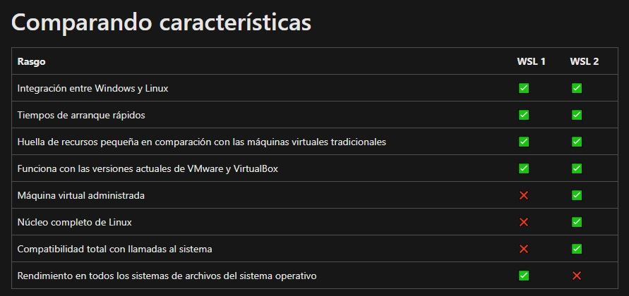

# <b>Ventajas de WSL</b>

<cite style="display:block; text-align: justify">El <b>Subsistema de Windows para Linux</b> puede ser útil tanto para usuarios aficionados que empiezan a dar los primeros pasos en este sistema operativo como para usuarios avanzados y administradores de sistemas.

La finalidad principal de WSL es permitir a los administradores de sistemas, y a los programadores, <b>usar todas las herramientas</b> y todos los servicios de Linux directamente desde Windows <b>sin tener que virtualizar</b> nada más ni montar infraestructuras complicadas. Al final, vamos a poder hacer todo lo que podríamos hacer si instalásemos Linux en una máquina virtual o en otro PC, y lo usáramos desde terminal o TTY. Todos los comandos de Linux deberían funcionar sin problema en Windows, como <b>apt</b> o <b>dpkg</b>. Incluso podremos <b>compilar código</b> directamente desde aquí con las ventajas que aporta Linux en este sentido.

Pero esta implementación también es útil para los usuarios que están dando sus primeros pasos dentro de los sistemas Linux. Gracias a ella, cualquier usuario podrá tener a su alcance todas las herramientas de Linux sin necesidad de tener que configurar ni virtualizar nada. Y, además, tendrá la <b>seguridad</b> de que, si algo sale mal, solo tendrá que reinstalar la distro en WSL, ya que Windows no se verá comprometido.

También hay que tener en cuenta que un problema persistente cuando ejecutamos Linux en su versión de escritorio es el soporte de hardware, especialmente en portátiles. Este problema es algo que no tendremos con WSL, ya nos aseguramos una compatibilidad total. Otra ventaja interesa es que, WSL nos va a permitir <b>una verdadera interoperabilidad entre Windows y Linux</b>, ya que vamos a poder explotar el sistema de archivos de Linux desde Windows y viceversa, así como iniciar programas desde las líneas de comando de uno y otro. Además, aunque aún no está disponible, en un futuro se podrán incluso <b>ejecutar programas con interfaz</b> gráfica.

WSL ya se ejecuta en Windows, por lo que no es necesario iniciar una máquina virtual cada vez que necesitamos de Linux, siempre y cuando <b>no dependamos de una interfaz gráfica.</b> Aunque una máquina virtual es más rápida y fácil de configurar, sigue siendo una máquina independiente al sistema operativo, aunque las limitaciones se reducen si activamos las opciones para compartir unidades y archivos entre el sistema operativo anfitrión y el invitado.

Si optamos por el <b>arranque dual</b>, debemos reservar espacio en el disco duro para instalar el sistema y asegurarse de tener medios de respaldo por si algo falla. Si queremos pasar de Windows a Linux o viceversa, la única solución para por reiniciar el equipo y arrancar con el sistema operativo que necesitamos en ese moento.</cite>

# <b>Inconvenientes y limitaciones</b>

<cite style="display:block; text-align: justify">Una de las principales <b>limitaciones de WSL</b> es que no es un Kernel nativo, sino que <b>depende de Hyper-V.</b> Y esto arrastra una serie de problemas e inconvenientes, como, por ejemplo, la escalabilidad y el rendimiento a la hora de ejecutar determinadas tareas. También debemos tener en cuenta que <b>WSL1 no tiene soporte para kernel-level,</b> por lo que algunos programas, como Docker, no funcionarán. Esto ya ha sido solucionado en WSL2.

La <b>conectividad de red</b> funciona en WSL, pero debe pasar por varias capas. Esto implica una considerable pérdida de rendimiento a la hora de ejecutar procesos que funcionen a bajo nivel de red. Y, también hay que tener en cuenta que, hay periféricos que no funcionan correctamente debido también a cómo Hyper-V controla a este Linux.

Además, no podemos obviar que, dado que WSL se ejecuta en un entorno de Windows, es posible que esto haga pensar a muchas personas que no es necesario instalar una versión de escritorio de Linux. Y es que dado que ya tienen un escritorio con Windows es posible que no vean el sentido que puede tener instalar un sistema operativo de escritorio completamente nuevo, pues ahora van a poder <b>ejecutar aplicaciones GUI de Linux en Windows.</b>

Aunque podemos hacer uso de WSL en Windows Server, las distribuciones disponibles en la Microsoft Store no están diseñadas para <b>ejecutarse como servidores</b>, lo que puede suponer un problema para muchos usuarios. La mayoría de estas distribuciones no ejecuta systemd, por lo que la tarea de lanzar servidores es prácticamente imposible.

WSL es una excelente opción para los usuarios con necesidades básicas. Sin embargo, no está pensado para grandes cargas de trabajo de producción, sino para tareas mucho más sencilla. Aunque con el lanzamiento de WSL2, la funcionalidad ha mejorado bastante, hasta que no se lance una interfaz gráfica, WSL seguirá siendo una característica de Windows muy limitada.</cite>

# <b>Diferencias con versiones y tecnologías de virtualización</b>

<cite style="display:block; text-align: justify">Hay varias versiones de este subsistema en función de la versión de Windows que utilicemos. Y, por supuesto, hay también diferencias con las distintas tecnologías de virtualización. A continuación, vamos a verlas todas ellas.</cite>

# <b>WSL1 y WSL2</b>

[1_2]:https://www.ionos.es/digitalguide/servidores/configuracion/virtualizacion/

[1_3]:https://www.ionos.es/digitalguide/servidores/know-how/maquina-virtual/

[1_4]:https://www.ionos.es/digitalguide/servidores/know-how/que-es-hyper-v/

[1_5]:https://www.ionos.es/digitalguide/servidores/configuracion/tutorial-docker-instalacion-y-primeros-pasos/

[1_6]:https://www.softzone.es/windows/como-se-hace/subsistema-windows-linux/

<cite style="display:block; text-align: justify">La diferencia fundamental entre WSL2 y su versión anterior se encuentra en la arquitectura del software. Mientras que WSL1 cuenta con una capa de compatibilidad para la transferencia de la ejecución del código entre Windows y Linux, WSL2 está basado en la [virtualización][1_2] de un sistema operativo Linux. [La máquina virtual][1_3] que se utiliza se ejecuta en el hipervisor nativo de Windows [Hyper-V][1_4], que ofrece un rendimiento especialmente alto.</cite>

<cite style="display:block; text-align: justify">Mientras que el abanico de funciones de la interfaz Linux de WSL1 era limitado, WSL2 utiliza un núcleoLinux completo. Se trata de núcleo optimizado especialmente para WSL2 en cuanto a tamaño y a rendimiento, basado en el código original estable de “kernel.org”. En la práctica, este planteamiento se traduce en una aceleración de la ejecución del código por un factor de entre dos y veinte. Además, WSL2 requiere menos capacidad de memoria que la versión previa. Para los usuarios resulta especialmente útil que en el núcleo se realicen las tareas de mantenimiento como parte de las actualizaciones regulares de Windows.

Puesto que WSL1 utiliza una capa de traducción para gestionar los accesos a Linux y a Windows, algunos tipos de software especializado de Linux no pueden incluirse. Por el contrario, la virtualización del núcleo de WSL2 ofrece compatibilidad completa con los accesos al sistema. En la práctica, esto significa que los elementos de software complejo como [Docker][1_5] también se pueden ejecutar con WSL2. Además, desde el entorno Linux se obtiene acceso a la tarjeta gráfica, lo que resulta ventajoso sobre todo en aplicaciones con grandes conjuntos de datos, como las que se usan para el machine learning o en contextos de data science.

Aunque se recomienda la utilización de WSL2 en sistemas modernos, ambas versiones pueden funcionar en paralelo. En cada distribución Linux es posible determinar qué versión WSL se debe utilizar para el control.</cite>

# <b>WSL2 vs máquina virtual</b>

<cite style="display:block; text-align: justify">Entonces,qué ventajas aporta WSL2 frente a instalar Linux en una máquina virtual como <b>VirtualBox</b> o <b>VMware</b>
* La primera diferencia es que, mientras que un Linux en una máquina virtual está aislado, WSL2 está totalmente integrado con Windows, por lo que ambos sistemas pueden interactuar entre sí. Además, el Subsistema de Windows puede cargar Linux en tan solo un segundo, mientras que una máquina virtual es bastante más lenta a la hora de arrancar el sistema.

* El consumo de recursos es también muy considerable. Mientras que <b>WSL2 es muy ligero y gasta muy poca memoria RAM,</b> una máquina virtual consume muchos más recursos en este aspecto.

* Y, aunque es cierto que una máquina virtual ofrece <b>más control y más opciones de personalización,</b> Windows Subsystem for Linux solo se ejecuta cuando lo necesitamos, y solo carga los procesos y servicios necesarios para lo que necesitemos hacer.

<b>Se puede usar una máquina virtual cuando</b>

* Necesitemos sacarle todo el provecho a Linux.
* Tengamos previsión de escalabilidad en función de los niveles de producción.
* Queramos usar un sistema operativo con interfaz y aplicaciones de entorno gráfico.
* Vayamos a hacer un uso intensivo de la red en el que el rendimiento es esencial.

<b>Podemos optar por WSL cuando</b>

* Queramos ejecutar comandos básicos de Linux.
* Queramos gastar poca memoria y pocos recursos del PC.
* Necesitemos eficiencia de almacenamiento.
* No queramos/podamos/sepamos usar máquinas virtuales.
* Queramos un acceso rápido al sistema de archivos, e interactuar con el sistema de archivos de Windows directamente.</cite>

# <b>WSL vs Docker</b>

<cite style="display:block; text-align: justify">Otra de las tecnologías más usadas cuando hablamos de virtualización es Docker. A diferencia de los métodos anteriores, esta tecnología no crea un entorno Linux completo que podemos usar sin limitaciones, sino que se crea, dentro de un contenedor, un entorno Linux mínimo sobre el cual debemos ejecutar tan solo un programa o servicio. La ventaja de esta tecnología es que todo lo que ejecutamos dentro de este contenedor funciona de forma aislada a todo lo demás. Es decir, si necesitamos tener en marcha dos servicios diferentes (por ejemplo, un servidor web y un servidor FTP), no los crearemos dentro de un mismo contenedor, sino que crearemos dos contenedores conectados, y dentro de cada uno se ejecutará cada servicio.

Docker es multiplataforma, y hace alusión al eslogan «Build, Share, and Run», por lo que es muy fácil poner en marcha cualquier servicio y mantenerlo. Incluso hacer copias de seguridad. Además, todo el entorno virtualizado es mucho más seguro gracias a que cada servicio está aislado, y un fallo en uno de ellos no dará acceso a todo el sistema a un atacante. Por desgracia, no todo son ventajas, y es que, al trabajar con contenedores, el desarrollo se hace siempre en producción (con el riesgo que eso supone), y además hay que dar más vuelta hasta entrar en la consola de desarrollo.</cite>

# Mas Información
* [Aprende a usar WSL, el Subsistema de Windows 10 para Linux][1_6]
