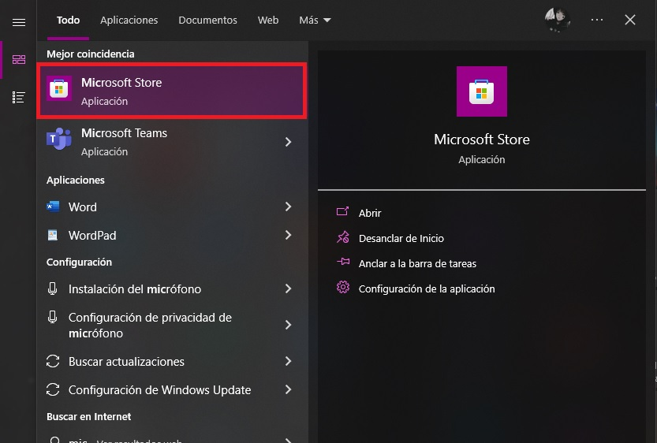
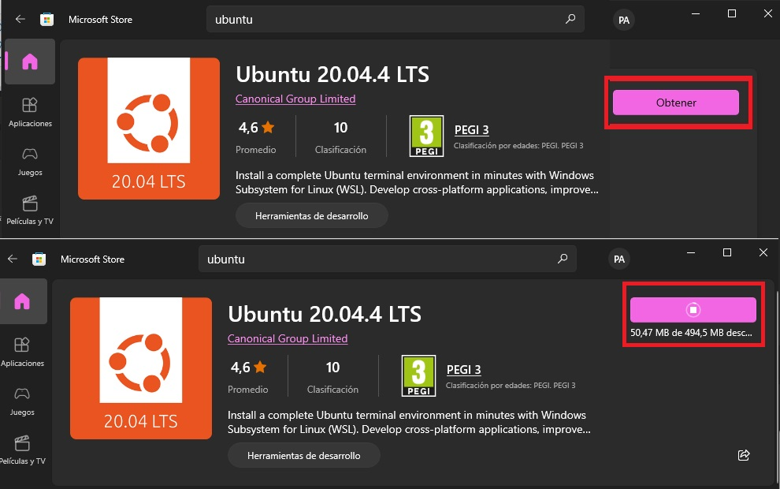
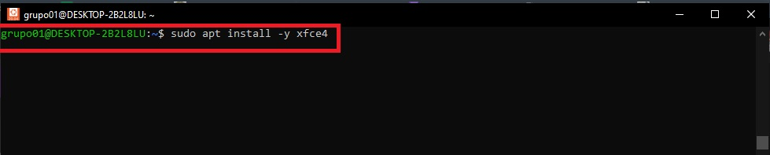

# <b>Instalar Linux en Windows con WSL</b>

<cite style="display:block; text-align: justify">
<b>PREREQUISITOS: </b> Lo primero que debemos hacer es verificar la versión de nuestro windows 10.

* Para eso lo que haremos sera darle clic al boton de inicio y escribimos <b>Winver</b></cite>

<cite style="display:block; text-align: justify">Le damos clic en la aplicación y nos mostrara la versión de nuestro Windows 10, debemos tener en cuenta que el WSL2 soporta desde la versión 2004 y posteriores (compilación 19041 y posteriores), teniendo en cuenta lo anterior verificamos que nuestro Windows 10 este en una de estas versiones, ya que de no ser asi el WSL2 no funcionara en nuestro sistema.</cite>

<cite style="display:block; text-align: justify">Una vez hayamos visto que versión de Windows tenemos le damos clic en Aceptar y nuevamente nos dirigiremos al botón de inicio, y escribimos <b>Características de Windows</b></cite>

<cite style="display:block; text-align: justify">Hacemos clic sobre esta aplicación y vamos a buscar las caracteristicas que debemos agregar, para este caso la primera caracteristica que vamos a agregar sera <b>La plataforma de maquina virtual</b> y la segunda caracteristica sera <b> Subsitema de Windows para Linux,</b> una vez agregadas estas dos caracteristicas presionaremos en el boton Aceptar.</cite>

<cite style="display:block; text-align: justify">Ahora comenzara a instalar algunos archivos, una vez encontrados los archivos aplicara los cambios a nuestro sistema y posteriormente nos pedira que reiniciemos nuestro sistema operativo para que se guarden los cambios .</cite>

<cite style="display:block; text-align: justify">Una vez que hayamos precionado sobre el boton "Reiniciar Ahora" nos aparecera una ventana igual a esta donde nos dira que esta configurando las actualizaciones de Windows y que no apaguemos el equipo.</cite>

<cite style="display:block; text-align: justify">Cuando nuestro sistema operativo se haya reiniciado vamos a continuar con el siguiente paso, que seria Instalar Ubuntu.</cite>

<cite style="display:block; text-align: justify">Para eso nos dirigimos hacia el boton de inicio y escribimos <b>Microsoft Store</b></cite>

<cite style="display:block; text-align: justify">Damos clic sobre esta aplicación, esperamos a que cargue, en la opción de busqueda escribiremos Ubuntu,</b> nos apareceran algunas versiones de Ubuntu, en nuestro caso la versión que vamos a escoger sera "Ubuntu 20.04 LTS"</cite>

<cite style="display:block; text-align: justify">Damos clic sobre esta versión y le daremos clic en Obtener, asi se iniciara la descarga, esto podra tardar unos minutos ya que dependera de la velocidad de internet que tengamos.</cite>

<cite style="display:block; text-align: justify">Una vez que la descarga termine, precionaremos sobre el boton abrir y nos aparecera una ventana emergente donde tendremos que esperar a que se instale y lo configure para nosotros.</cite>

<cite style="display:block; text-align: justify"></cite>

<cite style="display:block; text-align: justify">Cuando termine de hacer las configuraciones nos solicitara que ingresemos un Usuario, este usuario no tiene que ser el mismo usiario de Windows ya que el Usuario que nos pide crear sera el de Ubuntu.</cite>

<cite style="display:block; text-align: justify">En nuestro caso usaremos "grupo01" y presionamos Enter.</cite>

<cite style="display:block; text-align: justify">Tambien nos pediera que ingresemos una clave, una vez ingresada la clave nos dira que nuestra contraseña se ha creado correctamente.</cite>

<cite style="display:block; text-align: justify">Una vez creado el usuario y la contraseña de Ubuntu, vamos a precionar el boton de inicio de Windows y escribiremos <b>PowerShell</b></cite>

<cite style="display:block; text-align: justify">Hacemos clic derecho sobre la aplicación y la ejecutaremos como Administrador.</cite>

<cite style="display:block; text-align: justify">Se nos abrira la ventana de PowerShell de Windows, aqui vamos a ingresar una serie de comandos para terminar con la configuración de nuestro WSL2.</cite>

<cite style="display:block; text-align: justify">El primer comando que utilizaremos sera: 

                                        wsl -l -v 
Este comando nos dira que version de Ubuntu en WSL estamos corriendo, en nuestro caso nos dice que estamos corriendo la version 1.</cite>

<cite style="display:block; text-align: justify">Pero como nosotros necesitamos que corra la version WSL2, ejecutaremos el siguiente comando:

                            wsl --set-version Ubuntu-20.04 2
una vez ejecutado este comando nos dira que se necesita una actualizacion de nuestro componente de Kernel, nos pide que visitemos una pagina y nos daraun enlace el cual copiaremos y pegaremos en nuestro navegador.</cite>

<cite style="display:block; text-align: justify">En el paso 4 donde dice <b>"Paso 4: Descarga del paquete de actualización del kernel de Linux"</b> precionamos sobre la opción que dice "Paquete de actualización del kernel de Linux en WSL 2 para máquinas x64", automaticamente se comenzara a descargar el paquete de actualización.</cite>

<cite style="display:block; text-align: justify">Una vez que termine lo ejecutaremos e instalaremos.

Presionamos sobre el botón Next</cite>

<cite style="display:block; text-align: justify">Esperamos a que se cargen los paquetes, presionamos en el boton si y comenzara la instalación.

Una vez terminada la instalación le daremos en el botón finalizar</cite>

<cite style="display:block; text-align: justify">Nos vamos a la ventana de PowerShell y verificamos la versión del WSL utilizando el comando:

                                    wsl -l -v 
Nos dice que aun tenermos la version 1, asi que ejecutamos el comando 
            
                            wsl --set-version Ubuntu-20.04 2
y esperamos unos minutos a que haga la conversion</cite>

<cite style="display:block; text-align: justify">Una vez terminado este proceso, nos dira que la conversion se ha completado</cite>

<cite style="display:block; text-align: justify">Verificamos nuevamente la versión de nustro WSL, como podemos observar ya nos dice que estamos corriendo la version 2 de WSL</cite>

<cite style="display:block; text-align: justify">Ya corriendo con la version 2 de WSL proseguimos a configurar de una forma predeterminada nuestro WSL2, para eso ejecutaremos el siguiente comando:

                                    wsl --set-default-version 2
Presionamos enter y nos dira que la operación se completo correctamente.</cite>

<cite style="display:block; text-align: justify">Con esto ya estaremos corriendo de manera predeterminada la version 2 de WSL.

Continuamos con el siguiente paso, para esto regresaremos a la ventana de Ubuntu, aqui lo que vamos hacer sera actualizar la version de Ubuntu a la ultima para que todo funcione correctamente.

Para esto utilizaremos el siguiente comando:

                         sudo apt update && sudo apt -y upgrade
</cite>

<cite style="display:block; text-align: justify">Le damos enter y nos pedira que ingresemos la contraseña, una vez escribamos la contraseña comenzara la descarga de los paquetes para realizar la actualización.</cite>

<cite style="display:block; text-align: justify">Una vez terminada la actualización, continuaremos con la instalación de la interfaz Git, para esto tenemos que comprobar primero si tenemos corriendo el [XRDP][1_0], para esto utilizaremos el siguiente comando:

                                sudo apt-get purge xrdp
</cite>

[1_0]:https://en.wikipedia.org/wiki/Xrdp

<cite style="display:block; text-align: justify">Como podes observar el paquete XRDP no esta instalado</cite>

<cite style="display:block; text-align: justify">Una vez verificamos que no tenemos instalado el XRDP, ejecutaremos el siguiente comando para instalarlo

                            sudo apt install -y xrdp
</cite>

<cite style="display:block; text-align: justify">Comenzara a descargar los paquetes y posteriormente comenzara con la instalación
</cite>

<cite style="display:block; text-align: justify">Una vez terminado el proceso de instalación vamos a ejecutar el siguiente comando:

                            sudo apt install -y xfce4 
Esto nos permitira instalar una interfaz grafica libiana.</cite>

<cite style="display:block; text-align: justify">Nos aparecera esta ventana, escogeremos la primera opción, [GDM3][1_1], le damos en "OK" y continuara con la instalación.</cite>

[1_1]:https://es.wikipedia.org/wiki/GNOME_Display_Manager

<cite style="display:block; text-align: justify">Una vez terminada la instalación ejecutaremos el siguiente comando:

                            sudo apt install -y xfce4-goodies 
Precionamos enter y comenzara con la instalación.</cite>

<cite style="display:block; text-align: justify">Una vez terminada la instalación vamos a realizar algunas modificaciones en la configuración de XRDP, lo primero que haremos sera crear una copia de seguridad, para esto ejecutaremos el siguiente comando:

                    sudo cp /etc/xrdp/xrdp.ini /etc/xrdp/xrdp.ini.bak
</cite>

<cite style="display:block; text-align: justify">Vamos a cambiar el puerto <b>3389</b> por el puerto <b>3390, para esto ejecutaremos el siguiente comando:</b>
                    
                    sudo sed -i 's/3389/3390/g' /etc/xrdp/xrdp.ini 
</cite>

<cite style="display:block; text-align: justify">Cambiamos la resolución de la pantalla, ejecutando el siguiente comando:
                    
        sudo sed -i 's/max_bpp=32/#max_bpp=32\nmax_bpp=128/g' /etc/xrdp/xrdp.ini
</cite>

<cite style="display:block; text-align: justify">Para tener una mejor resolución de pantalla, ejecutamos el siguiente comando:
                    
        sudo sed -i 's/xserverbpp=24/#xserverbpp=24\nxserverbpp=128/g' /etc/xrdp/xrdp.ini
</cite>

<cite style="display:block; text-align: justify">Para guardar los cambios, ejecutamos el siguiente comando:
                    
                            echo xfce4-session > ~/.xsession 
</cite>

<cite style="display:block; text-align: justify">Para poder editar con nano, ejecutamos el siguiente comando:
                    
                            sudo nano /etc/xrdp/startwm.sh 
</cite>

<cite style="display:block; text-align: justify">Nos dirigimos hcaia estas lineas y les colocaremos un "#" segido por un espacio, colocaremos una etiqueta "#xfce" y copiamos el siguiente comando:

                                startxfce4
<cite>

<cite style="display:block; text-align: justify">Guardamos precionando "CTRL + X", precionamos la "Y" para guardar los cambios y precionamos enter.

Una vez realizadas estas configuraciones iniciaremos el servicio de XRDP para eso ejecutaremos el siguiente comando:

                            sudo /etc/init.d/xrdp start
<cite>

<cite style="display:block; text-align: justify">Nos dira que ya se ha iniciado el escritorio remoto, reiniciaremos nuestro pc para que se guarden los cambios.
<cite>

<cite style="display:block; text-align: justify">Una vez nuestro pc de reinicie, abrimos la ventana de Ubuntu y ejecutaremos dos comandos:

                    * sudo sed -i 's/3389/3390/g' /etc/xrdp/xrdp.ini
                    * sudo /etc/init.d/xrdp start (Para iniciar los servicios de XRDP)
<cite>

<cite style="display:block; text-align: justify">Precionamos el boton de inicio y escribimos, "escritorio remoto".
<cite>

<cite style="display:block; text-align: justify">Nos aparecera una ventana, en esta parte escribiremos:

                                localhost:3390
Precionamos en conectar.<cite>

<cite style="display:block; text-align: justify">Esperamos a que se carge el escritorio remoto, presionamos en el boton "si".<cite>

<cite style="display:block; text-align: justify">Ingresamos nuestro usuario y contraseña.<cite>

<cite style="display:block; text-align: justify">Y se cargara la interfaz.<cite>

<cite style="display:block; text-align: justify">Lo que nos queda por hacer es instalar el navegador, para esto abriremos la consola de comandos o la terminarl y ejecutaremos el siguiente comando:

                        sudo apt install firefox
<cite>

<cite style="display:block; text-align: justify">Una vez terminada la instalación vara a verificar si el navegador se instalo correctamente, precionaremos sobre el icono del mundo y se nos abrira el navegador de FireFox.<cite>

### Comandos utilizados
| # | Comandos |
|--|:--:|
| 1 | wsl -l -v |
| 2 | wsl --set-version Ubuntu-20.04 2 |
| 3 | wsl --set-default-version 2 |
| 4 |  sudo apt update && sudo apt -y upgrade |
| 5 | sudo apt-get purge xrdp |
| 6 | sudo apt install -y xrdp |
| 7 | sudo apt install -y xfce4  |
| 8 | sudo apt install -y xfce4-goodies  |
| 9 | sudo cp /etc/xrdp/xrdp.ini /etc/xrdp/xrdp.ini.bak |
| 10 |  sudo sed -i 's/3389/3390/g' /etc/xrdp/xrdp.ini  |
| 11 | sudo sed -i 's/max_bpp=32/#max_bpp=32\nmax_bpp=128/g' /etc/xrdp/xrdp.ini |
| 12 | sudo sed -i 's/xserverbpp=24/#xserverbpp=24\nxserverbpp=128/g' /etc/xrdp/xrdp.ini |
| 13 | echo xfce4-session > ~/.xsession  |
| 14 | sudo nano /etc/xrdp/startwm.sh |
| 15 | startxfce4 |
| 16 | sudo /etc/init.d/xrdp start |
| 17 | localhost:3390 |
| 18 | sudo apt install firefox |

# Mas Información
* [WSL 2 INSTALACIÓN y CONFIGURACIÓN de UBUNTU 20 en WINDOWS 10][1_3]
* [Comandos][1_4]

[1_3]:https://youtu.be/VcMqhRhzya8?t=1
[1_4]:https://gicodificador.blogspot.com/2022/02/instalacion-y-configuracion-de-wsl-2.html

