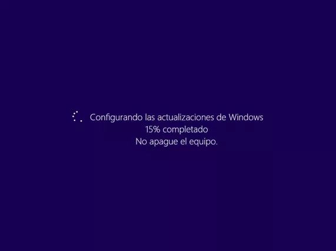

# <b>Instalar Linux en Windows con WSL</b>

 

<cite style="display:block; text-align: justify">
<b>PREREQUISITOS: </b> Lo primero que debemos hacer es verificar la versión de nuestro windows 10.

* Para eso lo que haremos sera darle clic al boton de inicio y escribimos <b>Winver</b></cite>

 

<cite style="display:block; text-align: justify">Le damos clic en la aplicación y nos mostrara la versión de nuestro Windows 10, debemos tener en cuenta que el WSL2 soporta desde la versión 2004 y posteriores (compilación 19041 y posteriores), teniendo en cuenta lo anterior verificamos que nuestro Windows 10 este en una de estas versiones, ya que de no ser asi el WSL2 no funcionara en nuestro sistema.</cite>

 

<cite style="display:block; text-align: justify">Una vez hayamos visto que versión de Windows tenemos le damos clic en Aceptar y nuevamente nos dirigiremos al botón de inicio, y escribimos <b>Características de Windows</b></cite>

<cite style="display:block; text-align: justify">Hacemos clic sobre esta aplicación y vamos a buscar las caracteristicas que debemos agregar, para este caso la primera caracteristica que vamos a agregar sera <b>La plataforma de maquina virtual</b> y la segunda caracteristica sera <b> Subsitema de Windows para Linux,</b> una vez agregadas estas dos caracteristicas presionaremos en el boton Aceptar.</cite>

<cite style="display:block; text-align: justify">Ahora comenzara a instalar algunos archivos, una vez encontrados los archivos aplicara los cambios a nuestro sistema y posteriormente nos pedira que reiniciemos nuestro sistema operativo para que se guarden los cambios .</cite>

<cite style="display:block; text-align: justify">Una vez que hayamos precionado sobre el boton "Reiniciar Ahora" nos aparecera una ventana igual a esta donde nos dira que esta configurando las actualizaciones de Windows y que no apaguemos el equipo.</cite>

<cite style="display:block; text-align: justify">Cuando nuestro sistema operativo se haya reiniciado vamos a continuar con el siguiente paso, que seria Instalar Ubuntu.</cite>

<cite style="display:block; text-align: justify">Para eso nos dirigimos hacia el boton de inicio y escribimos <b>Microsoft Store</b></cite>

<cite style="display:block; text-align: justify">Damos clic sobre esta aplicación, esperamos a que cargue, en la opción de busqueda escribiremos Ubuntu,</b> nos apareceran algunas versiones de Ubuntu, en nuestro caso la versión que vamos a escoger sera "Ubuntu 20.04 LTS"</cite>

<cite style="display:block; text-align: justify">Damos clic sobre esta versión y le daremos clic en Obtener, asi se iniciara la descarga, esto podra tardar unos minutos ya que dependera de la velocidad de internet que tengamos.</cite>

<cite style="display:block; text-align: justify">Una vez que la descarga termine, precionaremos sobre el boton abrir y nos aparecera una ventana emergente donde tendremos que esperar a que se instale y lo configure para nosotros.</cite>

<cite style="display:block; text-align: justify"></cite>

<cite style="display:block; text-align: justify">Cuando termine de hacer las configuraciones nos solicitara que ingresemos un Usuario, este usuario no tiene que ser el mismo usiario de Windows ya que el Usuario que nos pide crear sera el de Ubuntu.</cite>

<cite style="display:block; text-align: justify">En nuestro caso usaremos "grupo01" y presionamos Enter.</cite>

<cite style="display:block; text-align: justify">Tambien nos pediera que ingresemos una clave, una vez ingresada la clave nos dira que nuestra contraseña se ha creado correctamente.</cite>

