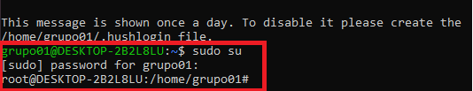
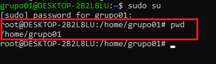
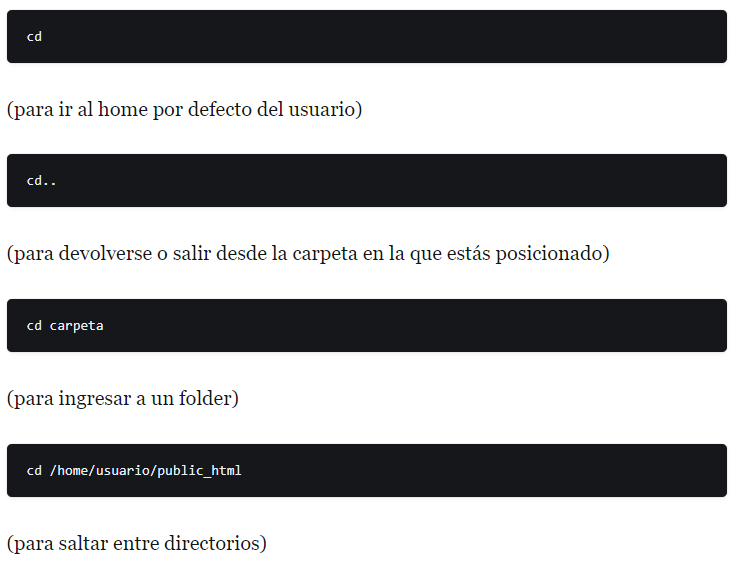
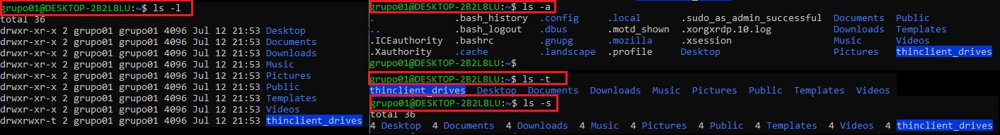
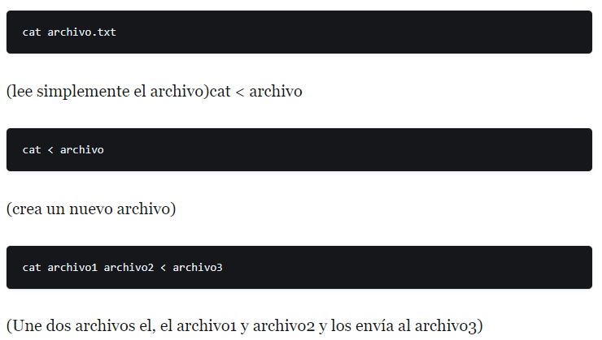
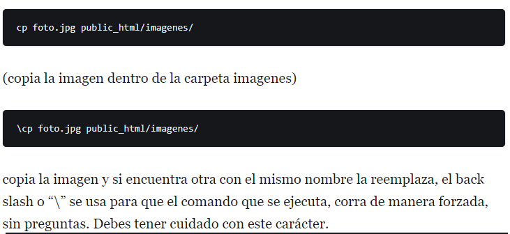

# <text style = "display:block; text-align: center"> <b>Algunos comandos basicos de Linux</b>

| **#** | **Comandos** |**Descripcion** |**Imagen**
|-- |:--:|:--:|:--:| 
| 1 | **Sudo** |El comando (sudo su) permite a los usuarios ejecutar programas con los privilegios de seguridad de otro usuario (normalmente el usuario root) de manera segura, convirtiéndose así temporalmente en súper usuario. **Sintaxis: sudo [opciones]**|  | 
| 2 | **pwd**| El comando pwd significa “directorio de trabajo de impresión” y es un comando de Linux simple pero útil. Este comando se usa para mostrar el nombre de su directorio actual, lo que puede ser útil al navegar por el sistema de archivos.| |
| 3 | **cd** | El comando cd de Linux se usa para cambiar el directorio de trabajo actual de un usuario. Se puede usar para subir un nivel en el sistema de archivos, o se le puede dar un directorio como argumento para cambiar el directorio de trabajo.| |
| 4 | **ls** | El comando ls es una utilidad de línea de comandos que enumera el contenido de un directorio.Se utiliza para enumerar archivos y directorios en sistemas operativos Unix y similares a Unix, incluido Linux.  El comando ls se puede utilizar con los siguientes parámetros: -l (lista en formato largo), -a (enumera todos los archivos, incluidos los ocultos), -t (ordenar por hora de última modificación), -S (ordenar por tamaño de archivo)| |
| 5 | **cat** | Cat, aunque es un comando simple en su nivel más básico, es uno de los comandos de Linux más utilizados en el sistema. Significa “concatenar” y se usa para mostrar lo que hay dentro de un archivo de texto. Solo puede usar cat si conoce el nombre y la extensión del archivo que desea mostrar.| |
| 6 | **cp** | El comando ‘cp’ es una utilidad de línea de comandos que copia archivos. Es uno de los comandos más útiles del sistema Linux y puede copiar archivos o directorios a otro directorio. El comando cp se puede usar con los comandos ‘cp’ o ‘mv’ para mover archivos.| |
| 7 |**mv** |El comando mv es un comando de Linux que se usa para mover y renombrar archivos y directorios.| |

# Mas Información
* [Comandos básicos para Linux][1_0]

[1_0]:https://www.dongee.com/tutoriales/comandos-basicos-de-linux/?utm_source=google&utm_medium=cpc&utm_campaign=tutoriales&utm_id=tutoriales&utm_term=comandos-linux&gclid=Cj0KCQjwyOuYBhCGARIsAIdGQRM1ubWe44FBrNIRzsT8n8WuLagbG4czJ1Bb9YQuaUfYpS0d17RaDvkaAvJCEALw_wcB

